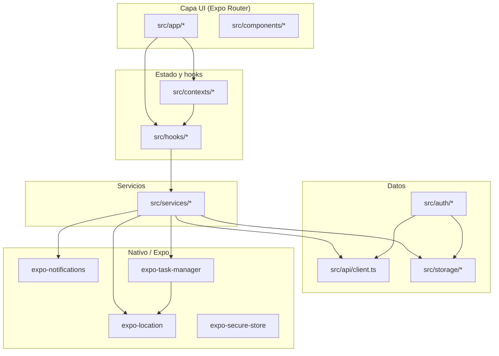

# Arquitectura

Visión de alto nivel de Rutafy Android orientada a mantenimiento y extensión.

---

## Diagrama de capas

---

## Punto de entrada

`src/app/_layout.tsx` monta:

| Pieza | Responsabilidad |
|-------|-----------------|
| `AuthProvider` | Sesión global, login/logout, refresh |
| `PushNotificationsBootstrap` | Listeners push (una sola vez) |
| `AuthNavigationGuard` | Redirección por rol y sesión |
| `Stack` (Expo Router) | Navegación file-based |
| Side-effect imports | Registro de background tasks al cargar módulo |

Las tasks GPS se registran importando:

- `@/services/backgroundLocationTask` — heartbeat mensajero
- `@/services/operatorTrackingTask` — captura logística

**No eliminar estos imports** sin entender el impacto en background.

---

## Routing (Expo Router)

Rutas principales:

| Ruta | Acceso | Descripción |
|------|--------|-------------|
| `/` | Público/autenticado | Redirect hub |
| `/welcome` | Público | Pantalla inicial |
| `/login` | Público | Inicio de sesión |
| `/register/*` | Público | Alta transportista / solicitud mensajero |
| `/mensajero/*` | MENSAJERO | Operación mensajero |
| `/transportista/*` | TRANSPORTISTA | Operación transportista |
| `/captura-logistica/*` | Autenticado | Captura GPS logística (ambos roles) |

Typed routes habilitado (`experiments.typedRoutes` en `app.json`).

---

## Roles

| `appRole` (backend) | Ruta home | En móvil |
|---------------------|-----------|----------|
| `MENSAJERO` | `/mensajero` | Sí |
| `TRANSPORTISTA` | `/transportista` | Sí |
| `ADMIN` | — | Rechazado |

El rol lo define el backend en `GET /v1/auth/me` (`appRole`, `actor_id`, `actor_type`). La app no permite “elegir rol” en login.

Utilidades: `src/utils/roles.ts`.

---

## Patrones de código

### Servicios (`src/services/`)

Funciones async puras o módulos con side-effects controlados (tasks). Hablan con API o storage. **No renderizan UI.**

### Hooks (`src/hooks/`)

Orquestan servicios + estado React. Ejemplos críticos:

- `useMensajeroOperations` — polling ofertas, disponibilidad, servicios activos
- `useOperatorTrackingSession` — sesión captura logística
- `usePushNotifications` — listeners globales push

### Contextos (`src/contexts/`)

Proveen estado compartido en subárboles:

- `MensajeroOperationsContext`
- `TransportistaServicesContext`

### Storage (`src/storage/`)

Persistencia local con SecureStore (native) / localStorage (web):

- `tokenStorage` — JWT access/refresh (en `src/auth/`)
- `pushTokenStorage` — Expo push token + device_id
- `trackingSessionStorage` — sesión captura activa
- `operatorTrackingHealthStorage` — métricas diagnóstico DEV

---

## Dependencias clave

| Paquete | Uso |
|---------|-----|
| `expo-router` | Navegación |
| `axios` | Cliente HTTP autenticado |
| `expo-location` | GPS foreground/background |
| `expo-task-manager` | Tasks en background |
| `expo-notifications` | Push |
| `expo-secure-store` | Secretos locales |
| `expo-constants` | Versión app, EAS projectId |

---

## Qué no mezclar

| Área | Aislamiento |
|------|-------------|
| Heartbeat mensajero | `backgroundLocationTask` — solo `/v1/mensajero/heartbeat` |
| Captura logística | `operatorTrackingTask` — solo batches de tracking sessions |
| Dispatch / ofertas | `useMensajeroOperations` — polling, no push dispatch aún |
| Auth | `AuthProvider` — no meter lógica de negocio GPS aquí |

Cambios en un módulo no deben importar internals del otro sin revisión de arquitectura.
