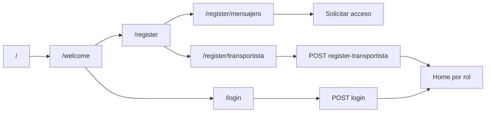

# Autenticación y navegación

Flujo de onboarding, sesión y protección de rutas.

---

## Flujo de usuario no autenticado



---

## Componentes

| Archivo | Rol |
|---------|-----|
| `src/auth/AuthProvider.tsx` | Estado sesión, login, logout, registro transportista |
| `src/auth/AuthContext.tsx` | Contrato del contexto |
| `src/auth/tokenStorage.ts` | Access + refresh token (SecureStore) |
| `src/auth/sessionEvents.ts` | Evento global sesión expirada |
| `src/services/authService.ts` | Login, logout, me, register transportista |
| `src/utils/normalizeAuthUser.ts` | Normaliza respuesta `/v1/auth/me` |
| `src/components/auth/AuthNavigationGuard.tsx` | Guard de rutas |
| `src/utils/authPublicRoutes.ts` | Rutas públicas onboarding |

---

## Login

1. `POST /v1/auth/login` con `{ phone, password }` (fetch directo, sin interceptor refresh en login).
2. Guardar `access_token` y opcionalmente `refresh_token`.
3. `GET /v1/auth/me` vía `apiClient`.
4. Validar:
   - Rol móvil soportado
   - `actor_id` presente
   - No ADMIN
5. `router.replace(getHomeHrefForUser(user))`.
6. **Push (fire-and-forget):** `registerDevicePushTokenAsync()`.

Errores de push **no bloquean** login.

---

## Registro transportista

Pantalla: `/register/transportista`

Endpoint: `POST /v1/auth/register-transportista`

Campos alineados con Rutafy Web (obligatorios: nombre, teléfono, contraseña, empresa, documento). Tras éxito: mismo flujo que login (tokens + `/me` + home).

---

## Registro mensajero

Pantalla: `/register/mensajero`

**No hay endpoint público** de autoregistro mensajero en Sprint actual. La pantalla muestra flujo “Solicitar acceso” (mailto). Las cuentas mensajero se provisionan vía administración backend.

---

## Refresh de sesión

Al abrir la app con token persistido:

1. `AuthProvider.refreshSession()` lee access token.
2. Llama `GET /v1/auth/me`.
3. Si válido → restaura usuario y re-registra push.
4. Si 401 confirmado → limpia sesión local.
5. Si error de red transitorio → mantiene token, muestra mensaje de red.

---

## Logout

Orden:

1. `unregisterDevicePushTokenAsync()` (si hay token push local).
2. `POST /v1/auth/logout` con refresh token.
3. Limpiar SecureStore auth.
4. Redirigir a `/login`.

Fallos en unregister **no bloquean** logout.

---

## AuthNavigationGuard

Comportamiento:

| Estado | Ruta | Acción |
|--------|------|--------|
| No auth | `/transportista`, `/mensajero`, `/captura-logistica` | → `/welcome` |
| No auth | `/welcome`, `/login`, `/register/*` | Permitido |
| Auth | onboarding público o `/` | → home del rol |
| Auth | rol incorrecto en stack ajeno | → home del rol |

---

## Tokens — almacenamiento

| Clave SecureStore | Contenido |
|-------------------|-----------|
| `rutafy_access_token` | JWT access |
| `rutafy_refresh_token` | JWT refresh |

El cliente axios (`src/api/client.ts`) adjunta `Authorization: Bearer` y renueva access token en 401 vía `/v1/auth/refresh`.

**Nunca loguear tokens completos.** En desarrollo, usar prefijos truncados si es necesario depurar.

---

## Integración post-login

Tras autenticación exitosa (login, registro o refresh):

```typescript
schedulePushRegistration(); // void registerDevicePushTokenAsync()
```

Ver [Push notifications](./push-notifications.md).
