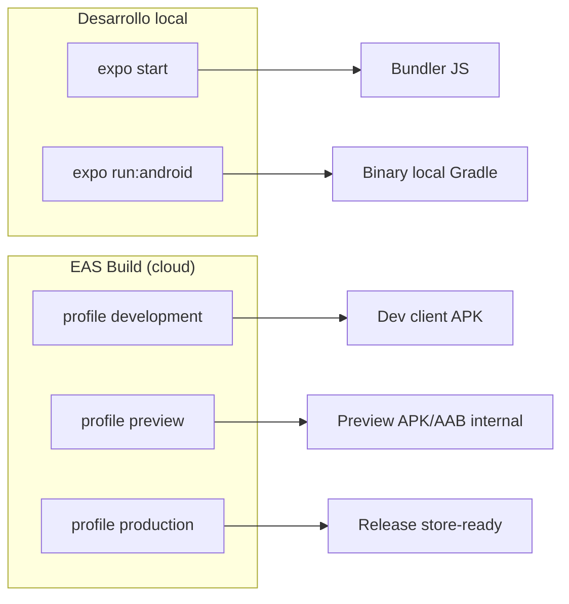
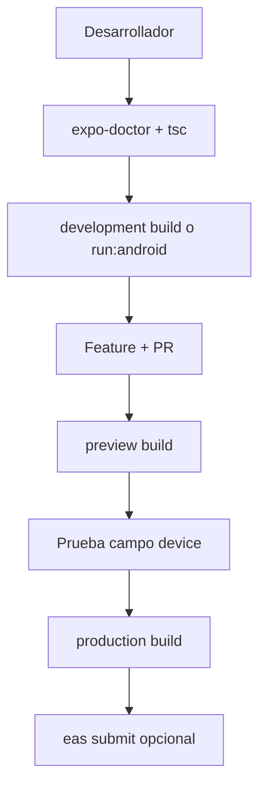

# Builds — Expo y EAS

Guía oficial para compilar, validar y distribuir Rutafy Android.

**Stack:** Expo SDK 56 · EAS Build · development client · Android (principal)

Relacionado: [Inicio rápido](./getting-started.md) · [Builds y mantenimiento](./builds-maintenance.md) · [Push notifications](./push-notifications.md)

---

## Identidad del proyecto

| Campo | Valor |
|-------|-------|
| Nombre app | Rutafy |
| Slug Expo | `rutafy-android` |
| Package Android | `com.rutafy.rutafyandroid` |
| Versión (`app.json`) | `1.0.0` |
| SDK | Expo 56 |
| Entry | `expo-router/entry` |
| Scheme | `rutafyandroid` |

El **EAS project ID** vive en `app.json` → `expo.extra.eas.projectId`. Es necesario para EAS Build y Expo Push Token. No commitear credenciales FCM/keystore en el repo.

---

## Expo vs EAS



| Herramienta | Uso en Rutafy |
|-------------|---------------|
| **Expo CLI** | Dev server, doctor, install, run nativo local |
| **EAS CLI** | Builds cloud, submit store, credenciales remotas |
| **Expo Go** | No recomendado — la app usa GPS background, FGS, SecureStore, push nativo |
| **Development build** | Sí — perfil `development` con `expo-dev-client` |

---

## Perfiles EAS (`eas.json`)

```json
{
  "cli": { "version": ">= 20.0.0", "appVersionSource": "remote" },
  "build": {
    "development": { "developmentClient": true, "distribution": "internal" },
    "preview": { "distribution": "internal" },
    "production": { "autoIncrement": true }
  },
  "submit": { "production": {} }
}
```

| Profile | Dev client | Distribución | Cuándo usar |
|---------|------------|--------------|-------------|
| **development** | Sí | internal | Día a día con equipo técnico |
| **preview** | No | internal | QA, operadores, prueba push/GPS en campo |
| **production** | No | store (default) | Release Play Store / producción |

`appVersionSource: remote` — versionado de build gestionado en EAS (coherente con `autoIncrement` en production).

---

## Validaciones pre-build

Ejecutar **antes** de cada build relevante o PR de release.

### Checklist obligatorio

```bash
npm install
npx expo-doctor
npx tsc --noEmit
```

| Comando | Qué valida |
|---------|------------|
| `npx expo-doctor` | SDK 56, dependencias alineadas, config Expo, assets icono, plugins |
| `npx tsc --noEmit` | Tipos TypeScript sin emitir JS |

### Checklist recomendado

```bash
npx expo install --fix    # alinear versiones Expo
```

| Verificación manual | Motivo |
|---------------------|--------|
| `.env.local` con `EXPO_PUBLIC_API_URL` correcto | Apunta al backend deseado (staging/prod) |
| Cambios en `app.json` plugins | Requieren rebuild nativo |
| Iconos 1024×1024 | `expo-doctor` falla si no cuadran |
| Device físico disponible | Push y GPS background no validables solo en emulador |

### Resultado esperado

```text
npx expo-doctor
✓ XX/XX checks passed. No issues detected!

npx tsc --noEmit
(sin salida = OK)
```

Si `expo-doctor` reporta issues, **resolver antes del build** salvo excepción documentada.

---

## Variables de entorno

Archivo plantilla: `.env.example`

```bash
EXPO_PUBLIC_API_URL=https://api.rutafy.app
```

| Variable | Scope | Notas |
|----------|-------|-------|
| `EXPO_PUBLIC_API_URL` | Público (bundle) | URL REST backend; no secretos |

Para builds EAS, configurar variables en **EAS Secrets / env** del dashboard o `eas.json` env blocks si el equipo lo adopta — nunca pegar secretos en este doc ni en git.

---

## Build: development

**Objetivo:** APK con dev client para iterar con módulos nativos (location, notifications, SecureStore).

### Prerrequisitos

- Cuenta Expo con acceso al proyecto EAS
- EAS CLI instalado globalmente
- Validaciones pre-build OK

### Comandos

```bash
npm install -g eas-cli
eas login
eas build --profile development --platform android
```

### Alternativa local (Gradle en máquina)

```bash
npm install
npx expo run:android
```

Útil para debug nativo rápido; el artefacto no pasa por EAS.

### Tras instalar

```bash
npx expo start --dev-client
```

Conecta Metro al binary development instalado.

---

## Build: preview

**Objetivo:** Binary **internal** para QA y operadores — sin dev menu, más cercano a producción.

### Cuándo usar preview

- Validar push notifications en device físico
- Validar GPS background (mensajero + captura logística)
- UAT antes de production
- Distribución interna (link EAS / APK sideload)

### Comando

```bash
eas build --profile preview --platform android
```

### Post-build QA (mínimo)

| Área | Prueba |
|------|--------|
| Onboarding | welcome → login → home por rol |
| Auth | refresh sesión, logout |
| Push | permisos → registro device → test push admin |
| Mensajero | disponibilidad, heartbeat background |
| Captura | start/end sesión, batches GPS |
| TypeScript | ya validado en pre-build |

Instalar APK en **dispositivo físico** desde enlace EAS. No usar emulador para push real.

---

## Build: production

**Objetivo:** Release para Play Store o distribución productiva.

### Comando build

```bash
eas build --profile production --platform android
```

`autoIncrement: true` incrementa `versionCode` Android en EAS automáticamente.

### Submit (opcional)

```bash
eas submit --profile production --platform android
```

Requiere credenciales Play Console configuradas en EAS (service account JSON en dashboard — **no en repo**).

### Pre-release checklist

- [ ] `npx expo-doctor` OK
- [ ] `npx tsc --noEmit` OK
- [ ] Preview probado en device físico
- [ ] `EXPO_PUBLIC_API_URL` apunta a producción en EAS env
- [ ] Changelog / versión revisados
- [ ] FCM credentials vigentes en Expo dashboard (push)
- [ ] Sin logs de tokens/PII en builds de release

---

## Plugins nativos (requieren rebuild)

Cambios en estos plugins **no** aplican con solo OTA JS:

| Plugin | Impacto |
|--------|---------|
| `expo-router` | Navegación nativa |
| `expo-splash-screen` | Splash |
| `expo-secure-store` | Almacenamiento seguro |
| `expo-location` | Background + foreground service GPS |
| `expo-notifications` | Push Android + icono notificación |
| `expo-image` | Decodificación nativa |

Tras modificar `app.json` → nuevo `eas build` (preview o production).

---

## Permisos Android declarados

Via `app.json` + plugins:

- `ACCESS_FINE_LOCATION` / `ACCESS_COARSE_LOCATION`
- `ACCESS_BACKGROUND_LOCATION`
- `FOREGROUND_SERVICE` / `FOREGROUND_SERVICE_LOCATION`
- `POST_NOTIFICATIONS` (vía expo-notifications)

Validar en preview que los diálogos de permisos aparecen y la operación continúa si el usuario deniega (degradación documentada en módulos GPS/push).

---

## OTA vs native binary

| Tipo cambio | ¿Nuevo build? |
|-------------|---------------|
| JS/TS pantallas, hooks, services | OTA posible si Updates está habilitado |
| `app.json`, plugins, permisos | **Sí** |
| Nueva dependencia con código nativo | **Sí** |
| Assets icono/splash | **Sí** (doctor lo exige) |
| `EXPO_PUBLIC_*` env en EAS | **Sí** (rebuild con env) |

Rutafy prioriza **binaries EAS** para features nativas críticas (GPS, push).

---

## Flujo recomendado por rol



| Rol | Acción |
|-----|--------|
| Developer | development + validaciones locales |
| QA / operaciones | preview APK internal |
| Release manager | production + submit |

---

## Troubleshooting builds

| Síntoma | Acción |
|---------|--------|
| `expo-doctor` icon size | Iconos 1024×1024 en `assets/images/` |
| Build EAS falla credenciales | Revisar keystore en Expo dashboard |
| Push no funciona en preview | Verificar FCM en Expo + device físico + rebuild post-plugin notifications |
| App apunta API incorrecta | Revisar EAS env / `.env.local` |
| `missing_project_id` push | Verificar `extra.eas.projectId` en app.json embebido en binary |

Más operación post-release: [Builds y mantenimiento](./builds-maintenance.md).

---

## Comandos de referencia rápida

```bash
# Validación
npx expo-doctor
npx tsc --noEmit

# Dev local
npm start
npx expo run:android

# EAS
eas login
eas build --profile development --platform android
eas build --profile preview --platform android
eas build --profile production --platform android
eas submit --profile production --platform android
```

---

## Documentación externa

- [Expo SDK 56](https://docs.expo.dev/versions/v56.0.0/)
- [EAS Build](https://docs.expo.dev/build/introduction/)
- [Development builds](https://docs.expo.dev/develop/development-builds/introduction/)
- [Expo Doctor](https://docs.expo.dev/develop/tools/#expo-doctor)
