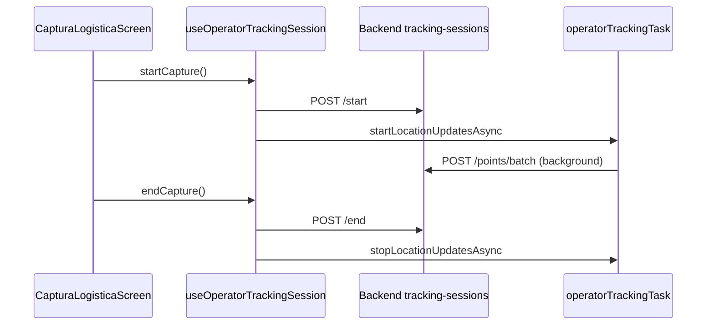

# GPS y tracking

Dos subsistemas GPS **independientes**. No unificarlos sin diseño explícito.

---

## Comparativa

| Aspecto | Heartbeat mensajero | Captura logística |
|---------|---------------------|-------------------|
| Task name | `rutafy-background-location` | `rutafy-operator-tracking` |
| Módulo | `backgroundLocationTask.ts` | `operatorTrackingTask.ts` |
| Trigger | Mensajero online / servicio activo | Sesión captura explícita |
| API | `POST /v1/mensajero/heartbeat` | `POST .../points/batch` |
| Storage health | — | `operatorTrackingHealthStorage` |
| UI | Integrado en flujo mensajero | `/captura-logistica/*` |

---

## Heartbeat mensajero

### Registro de task

Import side-effect en `_layout.tsx`:

```typescript
import '@/services/backgroundLocationTask';
```

### Comportamiento

- Task Manager recibe updates de ubicación en background.
- Throttle ~30s entre envíos.
- Requiere access token válido en SecureStore.
- Usa `expo/fetch` con header `Authorization` y `x-trace-id`.

### Servicio de sync

`backgroundLocationService.ts` — inicia/detiene tracking según estado operacional mensajero (`syncBackgroundTracking` desde `useMensajeroOperations`).

### Permisos Android (`app.json`)

- `ACCESS_FINE_LOCATION`
- `ACCESS_COARSE_LOCATION`
- `ACCESS_BACKGROUND_LOCATION`
- `FOREGROUND_SERVICE`
- `FOREGROUND_SERVICE_LOCATION`

Plugin `expo-location` con background y foreground service habilitados.

---

## Captura logística (operator tracking)

### Registro de task

```typescript
import '@/services/operatorTrackingTask';
```

### Flujo de sesión



### Endpoints

Ver `TRACKING_SESSION_ENDPOINTS` en `src/api/endpoints.ts`:

- `POST /v1/tracking-sessions/start`
- `GET /v1/tracking-sessions/my`
- `GET /v1/tracking-sessions/:id`
- `POST /v1/tracking-sessions/:id/points/batch`
- `POST /v1/tracking-sessions/:id/end`

### Persistencia local

`trackingSessionStorage` — sesión activa para recuperación tras kill de app.

### Diagnóstico (DEV)

- Logs `[operator-bg-*]`
- Panel `OperatorTrackingHealthPanel` en pantalla captura
- `operatorTrackingHealthStorage` — drops, batches, último error

**No usar panel DEV como métrica de producción.**

---

## Reglas de mantenimiento

1. **No modificar** `backgroundLocationTask` al trabajar captura logística (y viceversa) salvo bug crítico compartido.
2. Cambios de intervalo/throttle deben documentarse y probarse en device físico.
3. Background location en Android 10+ requiere permiso “Allow all the time” tras rationale UI.
4. Probar con app en background y pantalla apagada antes de release.

---

## Historial operacional

Pantallas read-only:

- `/captura-logistica/historial`
- `/captura-logistica/[sessionId]`

Hooks: `useMyTrackingSessions`, `useTrackingSessionDetail`

Parser/normalizer: `trackingSessionService.ts`
