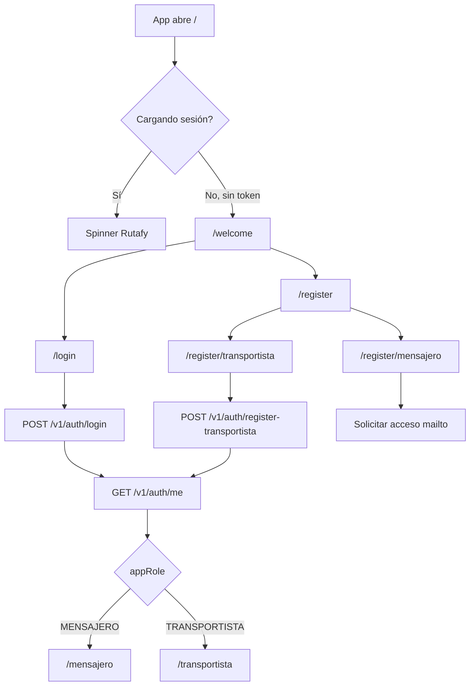
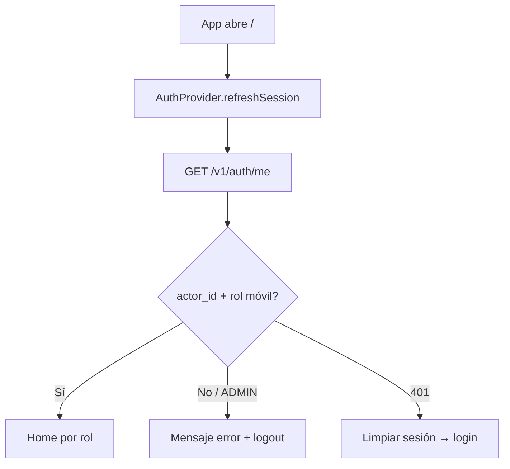
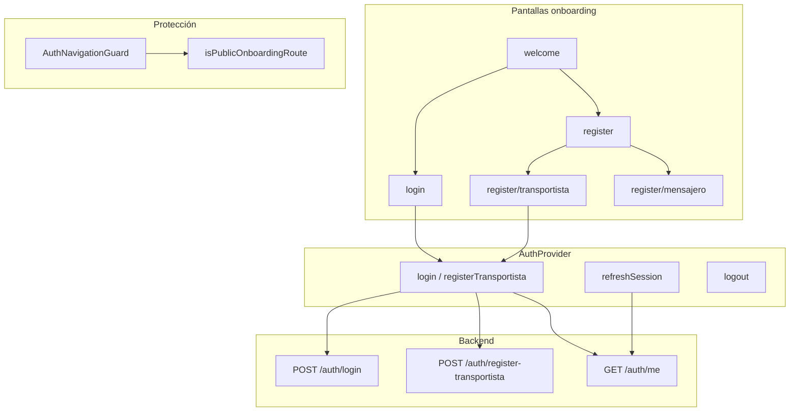

# Onboarding

Guía del flujo de entrada a Rutafy Android: pantallas públicas, registro, roles y protección de rutas.

Relacionado: [Autenticación y navegación](./auth-navigation.md) · [Arquitectura](./architecture.md)

---

## Resumen

Rutafy Android separa tres momentos:

1. **Onboarding público** — welcome, login, registro (sin sesión).
2. **Autenticación** — tokens JWT + perfil `/v1/auth/me`.
3. **Home operativo** — `/mensajero` o `/transportista` según rol del backend.

El usuario **no elige rol en login**. El backend asigna `appRole` y `actor_id`; la app valida y redirige.

---

## Mapa de pantallas

| Ruta | Archivo | Acceso | Propósito |
|------|---------|--------|-----------|
| `/` | `src/app/index.tsx` | Todos | Hub: loading → welcome o home |
| `/welcome` | `src/app/welcome.tsx` | Público | Pantalla inicial de marca |
| `/login` | `src/app/login.tsx` | Público | Inicio de sesión |
| `/register` | `src/app/register/index.tsx` | Público | Elegir tipo de cuenta |
| `/register/transportista` | `src/app/register/transportista.tsx` | Público | Alta transportista |
| `/register/mensajero` | `src/app/register/mensajero.tsx` | Público | Solicitud de acceso mensajero |
| `/mensajero/*` | `src/app/mensajero/` | MENSAJERO | Operación mensajero |
| `/transportista/*` | `src/app/transportista/` | TRANSPORTISTA | Operación transportista |

---

## Flujo de navegación

### Usuario sin sesión



### Usuario con sesión persistida



### Usuario autenticado que visita onboarding

Si hay sesión válida y el usuario navega a `/welcome`, `/login` o `/register/*`, **`AuthNavigationGuard`** lo redirige al home de su rol.

---

## Pantalla: Welcome (`/welcome`)

**Archivo:** `src/app/welcome.tsx`

**Contenido visible:**

- Logo Rutafy
- Tagline: *Logística conectada en tiempo real*
- Botón **Iniciar sesión** → `/login`
- Botón **Crear cuenta** → `/register`

**Comportamiento:**

- No llama API.
- No pide permisos.
- Es la pantalla de entrada cuando no hay sesión (`/` redirige aquí).

---

## Pantalla: Login (`/login`)

**Archivo:** `src/app/login.tsx`

**Contenido visible:**

- Logo + texto operativo
- Card *Acceso operativo*
- Campos: teléfono, contraseña
- Botón **Entrar**
- Link *¿No tienes cuenta? Crear cuenta* → `/register`

**Flujo técnico:**

1. Usuario envía formulario.
2. `useAuth().login({ phone, password })` → `AuthProvider.login`.
3. `authService.login` → `POST /v1/auth/login`.
4. Guarda tokens en SecureStore.
5. `GET /v1/auth/me` → normaliza `AuthUser`.
6. `finalizeAuthenticatedUser` valida rol y `actor_id`.
7. `router.replace(getHomeHrefForUser(me))`.
8. Push registration en background (`schedulePushRegistration`).

**Errores:** se muestran en pantalla vía `error` del contexto o validación local. Fallos de push no bloquean login.

---

## Pantalla: Register — selector (`/register`)

**Archivo:** `src/app/register/index.tsx`

**Contenido visible:**

- Título *Crear cuenta*
- Tarjeta **Soy mensajero** → `/register/mensajero`
- Tarjeta **Soy transportista** → `/register/transportista`
- Botón volver

**Comportamiento:**

- Solo navegación; sin API.

---

## Pantalla: Register transportista (`/register/transportista`)

**Archivo:** `src/app/register/transportista.tsx`

**Campos:**

| Campo | Obligatorio | Notas |
|-------|-------------|-------|
| Nombre | Sí | |
| Teléfono | Sí | |
| Contraseña | Sí | |
| Confirmar contraseña | Sí | Validación local |
| Nombre de empresa | Sí | Requerido por API backend |
| Número de documento | Sí | Requerido por API backend |
| Correo | No | |
| Placa | No | |

**Flujo técnico:**

1. `useAuth().registerTransportista(payload)`.
2. `POST /v1/auth/register-transportista`.
3. Mismo pipeline post-auth que login (tokens → `/me` → validación → home).
4. Home esperado: **`/transportista`**.

**Conflictos:** teléfono duplicado → error 409 con mensaje amigable.

---

## Pantalla: Register mensajero (`/register/mensajero`)

**Archivo:** `src/app/register/mensajero.tsx`

**Contenido visible:**

- Explicación: cuentas mensajero habilitadas por equipo Rutafy
- Botón **Solicitar acceso** → abre cliente de correo (`mailto:`)
- Link a login si ya tiene cuenta

**Importante:**

- **No existe** `POST /v1/auth/register-mensajero` en la app.
- **No se llama ningún endpoint** de registro mensajero.
- Tras solicitar acceso, el operador debe recibir credenciales por canal interno y usar **Login**.

---

## Roles

### Roles del backend (`appRole`)

| Valor | App móvil | Home |
|-------|-----------|------|
| `MENSAJERO` | Soportado | `/mensajero` |
| `TRANSPORTISTA` | Soportado | `/transportista` |
| `ADMIN` | **Rechazado** | Mensaje: solo web |

Definición de tipos: `src/types/auth.ts`.

### Derivación del rol

`normalizeAuthUser` (`src/utils/normalizeAuthUser.ts`) lee la respuesta de `/v1/auth/me`:

- `user.appRole`, `user.role`, `session.actor.actor_type`
- Valores reconocidos: `MENSAJERO`, `MESSENGER`, `TRANSPORTISTA`, `TRANSPORTER`, `ADMIN`

### Requisito operativo: `actor_id`

Además del rol, la sesión móvil exige `actor_id` no vacío (identificador operativo en backend). Sin él, la app cierra sesión con error *Sesión sin actor operativo válido*.

### Utilidades de rol

| Función | Archivo | Uso |
|---------|---------|-----|
| `getHomeHrefForUser(user)` | `src/utils/roles.ts` | Redirect post-login |
| `appRoleToMobileRole(appRole)` | `src/utils/roles.ts` | Guard de stacks |
| `isMobileSupportedRole(appRole)` | `src/utils/roles.ts` | Validación AuthProvider |
| `isAdminRole(appRole)` | `src/utils/roles.ts` | Bloqueo admin |

---

## Protección de rutas

Dos mecanismos complementarios:

### 1. `AuthNavigationGuard`

**Archivo:** `src/components/auth/AuthNavigationGuard.tsx`

Montado en `src/app/_layout.tsx`. Observa `pathname` y estado de `useAuth()`.

| Condición | Acción |
|-----------|--------|
| No autenticado + ruta operativa (`/mensajero`, `/transportista`, `/captura-logistica`) | `router.replace('/welcome')` |
| No autenticado + ruta pública onboarding | Permitido |
| Autenticado + `/`, `/welcome`, `/login`, `/register/*` | `router.replace(home del rol)` |
| Autenticado mensajero en `/transportista/*` | Redirect a `/mensajero` |
| Autenticado transportista en `/mensajero/*` | Redirect a `/transportista` |

### 2. Rutas públicas de onboarding

**Archivo:** `src/utils/authPublicRoutes.ts`

```typescript
isPublicOnboardingRoute(pathname):
  /welcome
  /login
  /register/*
```

Usado por el guard para no expulsar al usuario de flujos de alta/login.

### 3. Hub `/`

**Archivo:** `src/app/index.tsx`

- `isLoading` → spinner
- `!isAuthenticated` → `<Redirect href="/welcome" />`
- Autenticado → `<Redirect href={getHomeHrefForUser(user)} />`

### Captura logística

`/captura-logistica/*` requiere sesión (no es ruta pública). Accesible para mensajero y transportista autenticados desde pantalla Cuenta.

---

## AuthProvider

**Archivo:** `src/auth/AuthProvider.tsx`  
**Hook:** `src/auth/useAuth.ts`  
**Contexto:** `src/auth/AuthContext.tsx`

### Estado expuesto

| Campo | Tipo | Descripción |
|-------|------|-------------|
| `user` | `AuthUser \| null` | Perfil normalizado |
| `isLoading` | `boolean` | Bootstrap / login en curso |
| `isAuthenticated` | `boolean` | `user` o token persistido sin validar aún |
| `error` | `string \| null` | Último error auth/red |
| `login` | `(credentials) => Promise<AuthUser>` | Inicio de sesión |
| `registerTransportista` | `(payload) => Promise<AuthUser>` | Alta transportista |
| `logout` | `() => Promise<void>` | Cierre sesión |
| `refreshSession` | `() => Promise<void>` | Revalidar token al abrir app |

### Ciclo de vida al abrir la app

1. `useEffect` → `refreshSession()`.
2. Si hay access token → `fetchCurrentUser()`.
3. Valida rol + `actor_id`.
4. Si OK → `setUser`, `schedulePushRegistration()`.
5. Si red transitoria → mantiene token, muestra mensaje de red.
6. Si auth inválido → limpia SecureStore.

### `finalizeAuthenticatedUser`

Función interna compartida por login y registro transportista:

1. Rechaza `ADMIN`.
2. Rechaza roles no móviles.
3. Rechaza sin `actor_id`.
4. `setUser` + `setHasPersistedSession(true)`.
5. `schedulePushRegistration()` (push, fire-and-forget).

### Logout

1. `unregisterDevicePushTokenAsync()` (si hay token push local).
2. `authService.logout()` → invalida refresh en backend.
3. Limpia estado local.
4. `router.replace('/login')`.

### Sesión expirada

Listener en `sessionEvents`: interceptor axios emite evento en 401 no recuperable → limpia tokens → redirect `/login`.

### Tokens

Almacenados en SecureStore vía `src/auth/tokenStorage.ts`:

- `rutafy_access_token`
- `rutafy_refresh_token`

Ver [Seguridad y convenciones](./security-conventions.md).

---

## Diagrama: capas de onboarding



---

## Matriz: qué puede hacer cada usuario

| Acción | Sin sesión | Transportista | Mensajero | Admin |
|--------|------------|---------------|-----------|-------|
| Ver `/welcome` | Sí | Redirect home | Redirect home | N/A móvil |
| Login | Sí | — | — | Rechazado |
| Registro transportista | Sí | — | — | — |
| Solicitar acceso mensajero | Sí | — | — | — |
| `/transportista/*` | No | Sí | No | No |
| `/mensajero/*` | No | No | Sí | No |
| `/captura-logistica/*` | No | Sí | Sí | No |

---

## Archivos clave (referencia rápida)

```
src/app/
  index.tsx              # Redirect hub
  welcome.tsx
  login.tsx
  register/
    index.tsx
    transportista.tsx
    mensajero.tsx

src/auth/
  AuthProvider.tsx
  AuthContext.tsx
  useAuth.ts
  tokenStorage.ts
  sessionEvents.ts

src/components/auth/
  AuthNavigationGuard.tsx

src/utils/
  authPublicRoutes.ts
  roles.ts
  normalizeAuthUser.ts

src/services/
  authService.ts

src/constants/
  authScreenStyles.ts    # Estilos compartidos pantallas auth
```

---

## Mantenimiento: cambios frecuentes

| Cambio deseado | Dónde actuar |
|----------------|--------------|
| Nuevo copy welcome/login | Pantallas en `src/app/` |
| Nuevo campo registro transportista | `register/transportista.tsx` + payload en `authService` |
| Autoregistro mensajero (futuro) | Nueva pantalla + endpoint + `AuthProvider` |
| Nueva ruta pública | Añadir a `isPublicOnboardingRoute` + guard |
| Cambiar redirect sin sesión | `index.tsx` y/o guard |
| Relajar validación actor | `finalizeAuthenticatedUser` y `refreshSession` |

Tras cambios en auth, actualizar este documento y [auth-navigation.md](./auth-navigation.md).
