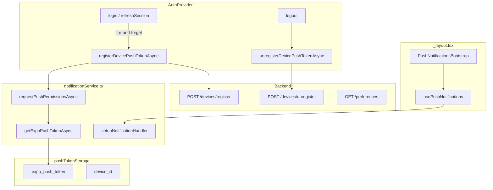
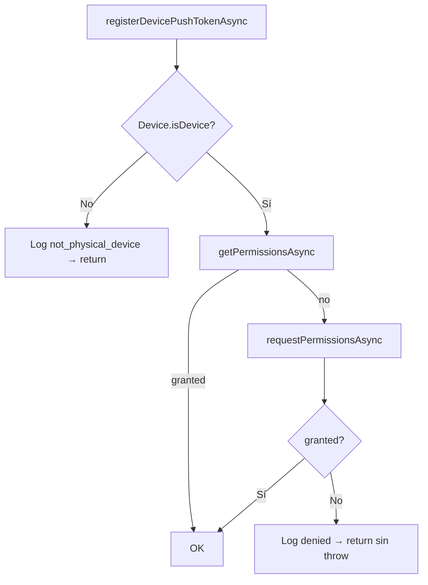
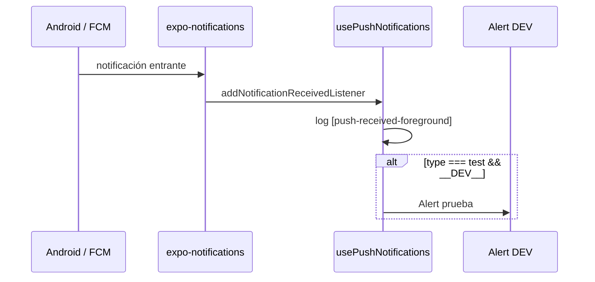
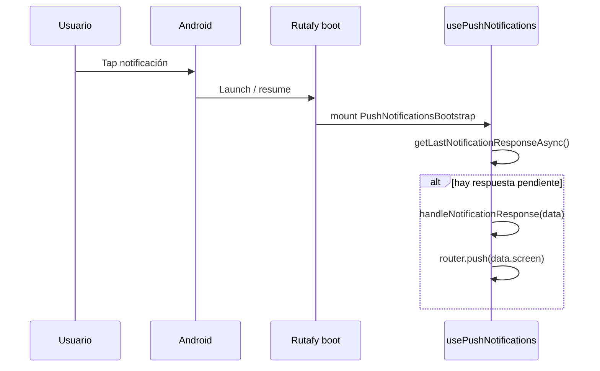
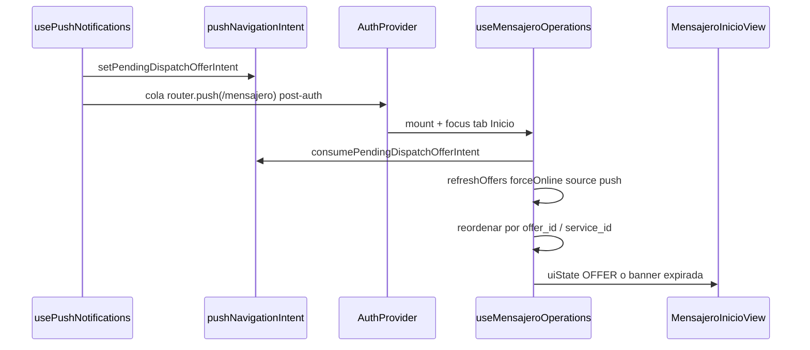

# Push notifications

Documentación del subsistema de notificaciones push en Rutafy Android (Sprint 1B + 1D).

Stack: **expo-notifications** · **expo-constants** · **expo-device** · **SecureStore**

Relacionado: [Autenticación](./auth-navigation.md) · [Integración API](./api-integration.md) · [Builds](./builds-maintenance.md)

---

## Resumen

| Capacidad | Estado |
|-----------|--------|
| Permisos OS | Implementado |
| Obtener Expo Push Token | Implementado |
| Registrar device en backend | Implementado |
| Desregistrar en logout | Implementado |
| Listener foreground | Implementado |
| Listener tap / respuesta | Implementado |
| Cold start (app abierta desde notificación) | Implementado |
| Background handler custom | No (OS + Expo handler) |
| `dispatch_offer` lógica de negocio | **Implementado Sprint 1D** |
| Navegación por `data.screen` | Implementado (genérico + cola post-auth) |

Los fallos de push **no bloquean** login, logout ni operación principal.

---

## Arquitectura



---

## Archivos

| Archivo | Responsabilidad |
|---------|-----------------|
| `src/services/notificationService.ts` | Permisos, token, register/unregister, handler, tipos data |
| `src/storage/pushTokenStorage.ts` | Persistencia token + device_id |
| `src/hooks/usePushNotifications.ts` | Listeners foreground, tap, cold start |
| `src/components/notifications/PushNotificationsBootstrap.tsx` | Montaje único |
| `src/auth/AuthProvider.tsx` | Registro post-auth, unregister pre-logout |
| `src/api/endpoints.ts` | `NOTIFICATION_ENDPOINTS` |

Montaje en `src/app/_layout.tsx` **dentro** de `AuthProvider` y junto al router.

---

## Permisos

### Solicitud

Función: `requestPushPermissionsAsync()` en `notificationService.ts`.



| Condición | Comportamiento |
|-----------|----------------|
| Emulador / simulador | `Device.isDevice === false` → no pide permiso, no obtiene token |
| Permiso ya concedido | Log `[push-permission]` granted, continúa |
| Usuario deniega | Log denied, registro abortado silenciosamente |
| Error | No rompe app ni login |

### Android

El plugin `expo-notifications` en `app.json` añade `POST_NOTIFICATIONS` (Android 13+). El diálogo del sistema aparece en el primer `requestPermissionsAsync()` tras login/registro.

### iOS / Web

La app está orientada a Android; en otras plataformas el flujo de permisos sigue la API de Expo Notifications con degradación natural.

---

## Expo Push Token

### Obtención

Función: `getExpoPushTokenAsync()`.

**Requisitos:**

1. Dispositivo físico (`expo-device`).
2. EAS `projectId` en configuración Expo:
   - `Constants.expoConfig?.extra?.eas?.projectId`
   - fallback: `Constants.easConfig?.projectId`
3. Permisos de notificación concedidos (paso previo).

Llamada:

```typescript
Notifications.getExpoPushTokenAsync({ projectId });
```

### Formato (ejemplo ficticio)

```
ExponentPushToken[xxxxxxxxxxxxxxxxxxxxxx]
```

**Nunca** documentar, commitear ni pegar en tickets un token real de producción.

### Errores comunes

| Log | Causa |
|-----|-------|
| `[push-token-error] not_physical_device` | Emulador |
| `[push-token-error] missing_project_id` | Falta `extra.eas.projectId` en build |
| `[push-token-error] empty_token` | Respuesta Expo vacía |
| `[push-token-error] message: …` | FCM/credenciales/red |

En logs de desarrollo solo se imprime un **prefijo truncado** del token (`slice(0, 24)…`).

### Persistencia local

| Clave SecureStore | Contenido |
|------------------|-----------|
| `rutafy_expo_push_token` | Último Expo Push Token registrado |
| `rutafy_device_id` | UUID estable generado en primera ejecución |

API storage:

- `getStoredExpoPushToken()` / `saveExpoPushToken()` / `clearStoredExpoPushToken()`
- `getOrCreateDeviceId()`

---

## Registro y desregistro backend

### Endpoints

| Método | Path |
|--------|------|
| POST | `/v1/notifications/devices/register` |
| POST | `/v1/notifications/devices/unregister` |
| GET | `/v1/notifications/preferences` |

*(preferences: definido en endpoints; sync UI pendiente Sprint 1C)*

### Cuándo registrar

`AuthProvider` llama `schedulePushRegistration()` → `registerDevicePushTokenAsync()` en:

- Login exitoso
- Registro transportista exitoso
- `refreshSession` con sesión válida

Fire-and-forget: no `await` en navegación.

### Payload register (estructura)

```json
{
  "expo_push_token": "ExponentPushToken[…]",
  "device_id": "a1b2c3d4-e5f6-4a7b-8c9d-0e1f2a3b4c5d",
  "platform": "android",
  "environment": "development",
  "app_version": "1.0.0"
}
```

| Campo | Origen |
|-------|--------|
| `environment` | `__DEV__ ? "development" : "production"` |
| `app_version` | `Constants.expoConfig.version` |
| `platform` | `Platform.OS` |

### Cuándo desregistrar

En `logout`, **antes** de `authService.logout()`:

1. Leer token local; si no existe → skip.
2. `POST /devices/unregister` con `{ expo_push_token, device_id }`.
3. `clearStoredExpoPushToken()` en `finally`.

Errores de unregister no bloquean logout.

### Session expired

Hoy **no** se desregistra automáticamente en expiración de sesión (solo logout explícito). Pendiente Sprint 1C.

---

## Listeners

Montados **una sola vez** en `usePushNotifications` vía `PushNotificationsBootstrap`.

### Setup inicial

Al montar el hook:

1. `setupNotificationHandler()` — configura cómo Expo muestra notificaciones con app en foreground.
2. `getLastNotificationResponseAsync()` — cold start (ver abajo).
3. `addNotificationReceivedListener` — foreground.
4. `addNotificationResponseReceivedListener` — tap con app en background o foreground.

Cleanup en unmount: `subscription.remove()`.

### Notification handler (foreground display)

`setNotificationHandler` retorna:

| Flag | Valor |
|------|-------|
| `shouldShowAlert` | true |
| `shouldPlaySound` | true |
| `shouldSetBadge` | false |
| `shouldShowBanner` | true |
| `shouldShowList` | true |

Define si la notificación se muestra visualmente cuando la app está **abierta y visible**.

---

## Foreground

**App activa y visible** cuando llega la push.



**Qué hace la app:**

- Parsea `notification.request.content.data`.
- Log `[push-received-foreground]` con `type` y `screen`.
- Si `type === "test"` y `__DEV__`: `Alert.alert` informativo.
- **No navega** automáticamente en foreground (solo en tap / cold start).

**Qué no hace:**

- No refresca ofertas dispatch.
- No modifica `useMensajeroOperations`.

---

## Background

**App en segundo plano** (minimizada, proceso vivo).

| Aspecto | Comportamiento Rutafy |
|---------|----------------------|
| Recepción | La muestra el sistema (bandeja Android) |
| Listener `received` | Puede no ejecutarse igual que foreground; depende de OS |
| Interacción usuario | Tap en notificación → `addNotificationResponseReceivedListener` |
| Código custom background | **No hay** task headless propia |

Rutafy **no** implementa `Notifications.registerTaskAsync` ni handler JS con app killed-only. El stack Sprint 1B confía en:

- FCM → Expo Push Service → expo-notifications nativo
- Respuesta al **tap** para lógica de navegación

Para `dispatch_offer` en background, el mensajero verá la notificación del sistema; al tocarla se dispara el flujo de respuesta (igual que cold start parcial).

---

## Cold start

**App cerrada o no en memoria**; usuario toca la notificación.



Implementación:

```typescript
Notifications.getLastNotificationResponseAsync().then((response) => {
  if (!response) return;
  handleNotificationResponse(parsePushNotificationData(...));
});
```

Log: `[push-response]` → si hay `screen`, `[push-navigate]`.

**Orden con auth (Sprint 1D):** el bootstrap encola `router.push` hasta `!isLoading`. Si no hay sesión mensajero, descarta intent y no navega a rutas protegidas.

---

## Payload `data` — tipos

Tipo TypeScript: `PushNotificationData` en `notificationService.ts`.

```typescript
{
  type?: string;
  screen?: string;
  service_id?: string;
  offer_id?: string;
  expires_at?: string;
}
```

Los campos viajan en `notification.request.content.data` (objeto plano JSON desde backend/Expo push API).

---

## Tipo: `test`

Push de validación (admin test endpoint).

### Ejemplo ficticio

```json
{
  "type": "test",
  "screen": "/mensajero"
}
```

### Comportamiento app

| Estado app | Acción |
|------------|--------|
| Foreground | Log + Alert DEV |
| Background / killed + tap | Log `[push-response]` + `router.push("/mensajero")` |

Sirve para verificar registro de device, FCM y navegación básica sin lógica dispatch.

---

## Tipo: `dispatch_offer`

Notificación operativa: **nueva oferta de servicio** para mensajero.

### Payload esperado

```json
{
  "type": "dispatch_offer",
  "service_id": "00000000-0000-4000-8000-000000000001",
  "offer_id": "00000000-0000-4000-8000-000000000002",
  "screen": "/mensajero",
  "expires_at": "2026-06-07T12:00:00.000Z"
}
```

| Campo | Uso |
|-------|-----|
| `type` | Discriminador `dispatch_offer` |
| `service_id` | ID servicio en backend |
| `offer_id` | ID oferta para accept + priorización en UI |
| `screen` | Ruta destino (normalizada a `/mensajero` si falta o es inválida) |
| `expires_at` | ISO8601; validación local antes del refresh |

### Comportamiento Sprint 1D (tap / cold start)



**Al tocar la notificación:**

1. Guarda intent en memoria (`pushNavigationIntent.ts`).
2. Encola navegación a `/mensajero` cuando `!isLoading` y usuario autenticado mensajero.
3. Tab **Inicio** consume el intent al enfocarse (`useFocusEffect`).
4. `refreshOffers({ forceOnline: true, source: 'push' })` complementa el polling (no lo reemplaza).
5. Prioriza la oferta del push en `availableServices[0]`.
6. Si la app está OFFLINE localmente, muestra `MensajeroOfferScreen` mientras el intent push esté activo.
7. Si la oferta no existe o `expires_at` ya pasó → banner “La oferta ya no está disponible o expiró.”.

**No hace:**

- Auto-aceptar ofertas.
- Crear ruta `/mensajero/oferta/[offerId]`.
- Refresh en foreground sin tap del usuario.

### Archivos involucrados

| Archivo | Rol |
|---------|-----|
| `src/services/pushNavigationIntent.ts` | Intent en memoria |
| `src/hooks/usePushNotifications.ts` | Handler + cola post-auth |
| `src/hooks/useMensajeroOperations.ts` | Refresh push + priorización + override UI |
| `src/app/mensajero/(tabs)/index.tsx` | Consume intent al focus |
| `src/utils/reorderOffersForIntent.ts` | Reordenar lista de ofertas |

### Relación con polling actual

El mensajero sigue obteniendo ofertas vía **polling** en `useMensajeroOperations`. Push `dispatch_offer` es **complemento** para latencia al abrir la app desde la notificación.

---

## Integración AuthProvider

```typescript
function schedulePushRegistration(): void {
  void registerDevicePushTokenAsync();
}
```

| Evento | Push |
|--------|------|
| `finalizeAuthenticatedUser` | register |
| `refreshSession` OK | register |
| `logout` | unregister → logout API |

Cambio de usuario en mismo device: nuevo login registra token otra vez (backend asocia device al user activo).

---

## Configuración nativa

### `app.json`

```json
{
  "plugins": [
    ["expo-notifications", {
      "icon": "./assets/images/android-icon-foreground.png",
      "color": "#2A9D8F"
    }]
  ],
  "extra": {
    "eas": {
      "projectId": "<uuid-proyecto-eas>"
    }
  }
}
```

Cambios en plugin → **rebuild EAS** obligatorio.

### Credenciales FCM

Push real en producción requiere credenciales Firebase configuradas en Expo/EAS dashboard. Sin ellas, token puede obtenerse pero entrega falla.

---

## Logs de diagnóstico

| Tag | Momento |
|-----|---------|
| `[push-permission]` | Resultado permisos |
| `[push-token]` | Token obtenido (prefijo) |
| `[push-token-error]` | Fallo token |
| `[push-register-start/ok/error]` | Registro backend |
| `[push-unregister-start/ok/error]` | Desregistro |
| `[push-received-foreground]` | App visible, push llegó |
| `[push-response]` | Tap o cold start |
| `[push-navigate]` | `router.push(screen)` |

---

## Prueba manual

1. Build dev/preview con plugin notifications.
2. Login en **device físico** → aceptar permisos.
3. Verificar device en backend (sin copiar token a Slack/issues).
4. `POST /v1/admin/notifications/test` con payload `type: test`.
5. Probar:
   - App foreground → banner + log (+ Alert DEV).
   - App background → tap → navegación.
   - App killed → tap → cold start + navegación.
6. Logout → device desregistrado.

---

## Limitaciones conocidas

| Limitación | Notas |
|------------|-------|
| Emulador sin token real | Usar device físico |
| `dispatch_offer` sin oferta activa | Banner informativo; polling continúa |
| Deep link antes de auth | Cola post-auth en `usePushNotifications`; sin sesión → welcome |
| Session expired | No unregister push |
| `/mensajero/ofertas` | Ruta inexistente; backend debe usar `/mensajero` o agregar ruta |
| Preferences API | Sin UI sync aún |

---

## Mantenimiento

| Cambio | Archivo |
|--------|---------|
| Nuevo tipo push | `PushNotificationData` + handler en `usePushNotifications` |
| Campos register | `RegisterDevicePayload` + `buildRegisterPayload` |
| Momento registro | `AuthProvider.schedulePushRegistration` |
| Comportamiento foreground UI | `setupNotificationHandler` o `handleForegroundNotification` |
| Deep link post-auth | Cola en guard o hook (1C) |

Actualizar este documento al cerrar Sprint 1C.
