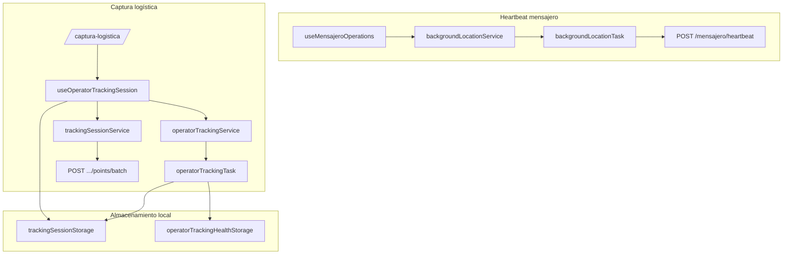
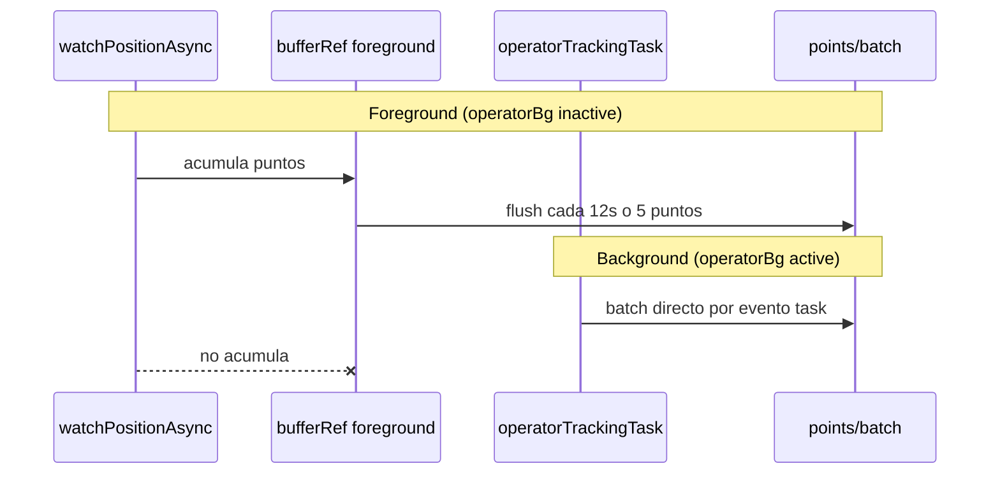
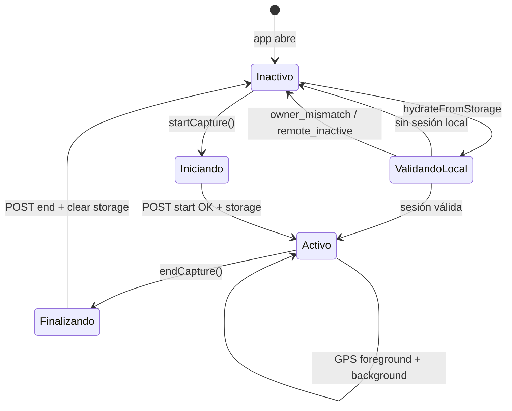
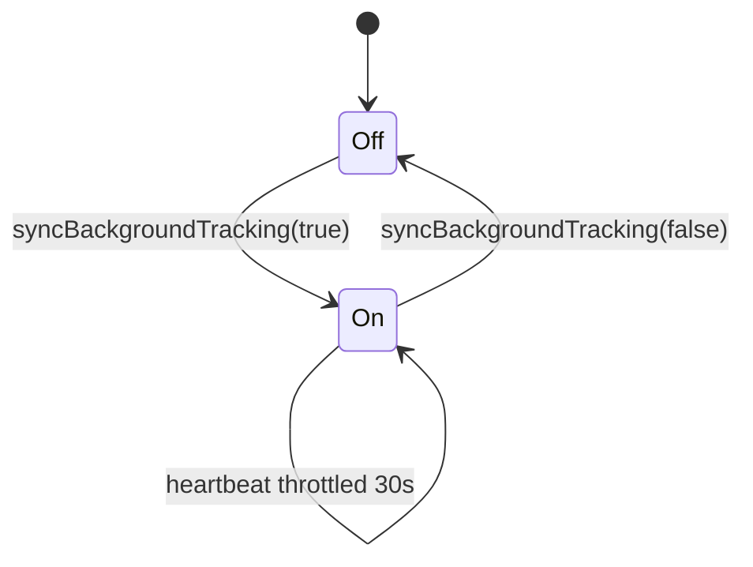

# Tracking GPS

Documentación del subsistema de ubicación y captura logística en Rutafy Android.

Rutafy tiene **dos pipelines GPS independientes**. Este documento detalla ambos, con énfasis en **captura logística** (sesiones, ownership, sincronización).

Relacionado: [GPS y tracking (referencia rápida)](./gps-tracking.md) · [Módulos operativos](./operational-modules.md) · [Integración API](./api-integration.md)

---

## Visión general



| Pipeline | Task | Propósito |
|----------|------|-----------|
| **Mensajero** | `rutafy-background-location` | Ubicación durante servicio activo → heartbeat |
| **Captura logística** | `rutafy-operator-tracking` | Registro de ruta operativa → batches de puntos |

**Regla de arquitectura:** no compartir task, buffer ni storage entre ambos. No iniciar captura logística si el heartbeat mensajero está activo.

---

## 1. Background location

### 1.1 Heartbeat mensajero

**Archivos:**

- `src/services/backgroundLocationTask.ts` — define task + envío heartbeat
- `src/services/backgroundLocationService.ts` — start/stop/sync permisos
- Invocado desde `useMensajeroOperations` vía `syncBackgroundTracking(enabled)`

**Cuándo se activa:**

- Mensajero en línea con servicio operacional activo (estado derivado de polling de servicios/ofertas).

**Comportamiento:**

- Task Manager recibe updates GPS en background.
- Toma la **última ubicación válida** del batch.
- Throttle ~30 s entre envíos (`THROTTLE_MS`).
- `POST /v1/mensajero/heartbeat` con `{ lat, lng }` y Bearer token.
- Foreground service: *"Rutafy está siguiendo el servicio"*.

**Parámetros de location updates:**

| Parámetro | Valor |
|-----------|-------|
| Accuracy | Balanced |
| timeInterval | 30 000 ms |
| distanceInterval | 25 m |

### 1.2 Background captura logística (operator)

**Archivos:**

- `src/services/operatorTrackingTask.ts` — task + POST batch en background
- `src/services/operatorTrackingService.ts` — permisos, start/stop FGS

**Cuándo se activa:**

- Tras `startCapture()` exitoso en `useOperatorTrackingSession`.
- Re-hidratación al abrir app con sesión local activa (`ensureOperatorBackgroundTracking`).

**Comportamiento:**

- Convierte locations del task a `TrackingPointInput[]` (`locationsToTrackingPoints`).
- Lee `sessionId` desde `trackingSessionStorage.getActive()`.
- Si no hay sesión → drop con log `[operator-bg-task-drop]`.
- `POST /v1/tracking-sessions/:id/points/batch` vía `expo/fetch`.
- Foreground service: *"Captura logística activa"*.

**Parámetros:**

| Parámetro | Valor |
|-----------|-------|
| Accuracy | High |
| timeInterval | 20 000 ms |
| distanceInterval | 10 m |
| deferredUpdatesInterval | 20 000 ms |

**Exclusión mutua:** `startOperatorTrackingAsync` **no arranca** si la task mensajero (`rutafy-background-location`) ya está activa.

### 1.3 Foreground watch (captura)

Paralelo al background operator, el hook mantiene `Location.watchPositionAsync` en foreground:

| Parámetro | Valor |
|-----------|-------|
| timeInterval | 20 000 ms |
| distanceInterval | 10 m |
| metadata source | `android_mvp` |

Si `operatorBgActive === true`, el watch **no acumula** puntos en buffer (el background es la fuente primaria).

---

## 2. Sesiones de tracking

### 2.1 Modelo de dominio

Tipos en `src/types/tracking.ts`:

**`TrackingSession`** (remoto, backend):

| Campo | Descripción |
|-------|-------------|
| `id` | UUID sesión |
| `status` | `active` \| `ended` \| `abandoned` |
| `purpose` | Ver propósitos abajo |
| `vehicle_label` | Etiqueta vehículo/unidad |
| `owner_user_id`, `actor_id`, `actor_type` | Propiedad operativa |
| `started_at`, `ended_at` | Timestamps |

**Propósitos (`TrackingSessionPurpose`):**

- `operacion_interna`
- `traslado_variante`
- `puerto`
- `patio`
- `terminal`

**`StoredTrackingSession`** (local, SecureStore):

```typescript
{
  sessionId: string;
  ownerUserId: string;
  actorId: string;
  actorType: string | null;
  purpose: TrackingSessionPurpose;
  vehicleLabel: string;
  startedAt: string;
}
```

### 2.2 API de sesiones

Servicio: `src/services/trackingSessionService.ts`

| Operación | Endpoint |
|-----------|----------|
| Iniciar | `POST /v1/tracking-sessions/start` |
| Detalle | `GET /v1/tracking-sessions/:id` |
| Mis sesiones | `GET /v1/tracking-sessions/my` |
| Batch puntos | `POST /v1/tracking-sessions/:id/points/batch` |
| Finalizar | `POST /v1/tracking-sessions/:id/end` |

Body start incluye: `purpose`, `vehicle_label`, `consent_accepted`, `notes`, `metadata`.

### 2.3 Pantallas

| Ruta | Uso |
|------|-----|
| `/captura-logistica` | Control sesión activa (start/end) |
| `/captura-logistica/historial` | Listado read-only |
| `/captura-logistica/[sessionId]` | Detalle read-only |

Acceso desde **Cuenta** (mensajero y transportista autenticados).

---

## 3. Ownership (propiedad de sesión)

**Archivo:** `src/utils/trackingSessionOwnership.ts`

### Problema que resuelve

Tras kill de app, cambio de usuario o sesión remota cerrada, el dispositivo podría conservar una sesión local que **no pertenece** al operador actual.

### Regla de ownership

`isStoredTrackingSessionOwnedByUser(stored, user)` exige coincidencia exacta:

| Campo local | Campo usuario actual |
|-------------|----------------------|
| `ownerUserId` | `user.user_id` |
| `actorId` | `user.actor_id` |
| `actorType` | `user.actor_type` |

Si falla → `clearActiveTrackingSession('owner_mismatch')`: detiene operator task + borra storage.

### Construcción al iniciar

`buildStoredTrackingSession(session, user, vehicleLabel)`:

- Prioriza `owner_user_id` / `actor_id` / `actor_type` del response backend.
- Fallback a datos del `AuthUser` actual.
- Falla si faltan IDs de propietario.

### Validación remota en hidratación

Al reabrir app con sesión local:

1. Verificar ownership local.
2. `GET /v1/tracking-sessions/:id`.
3. Si `status !== 'active'` → clear (`remote_inactive`).
4. Si 403/404 → clear (`remote_forbidden`).

---

## 4. Captura logística

### 4.1 Hook central

**`useOperatorTrackingSession`** (`src/hooks/useOperatorTrackingSession.ts`)

Estado expuesto a UI:

| Campo | Descripción |
|-------|-------------|
| `isActive` | Hay sesión local con `sessionId` |
| `operatorBgActive` | Task background operator corriendo |
| `storedSession` | Snapshot local |
| `pointsSent` | Contador puntos aceptados (UI) |
| `lastPointAt` | Último timestamp capturado |
| `elapsedSeconds` | Duración desde `startedAt` |
| `startCapture` / `endCapture` | Acciones principales |

### 4.2 Precondiciones de inicio

1. Usuario autenticado.
2. Consentimiento explícito en UI.
3. `vehicle_label` no vacío.
4. No hay otra sesión local activa.
5. `assertCanStartOperatorCapture(actorId, appRole)`:
   - No heartbeat mensajero activo.
   - Si rol MENSAJERO: no servicio operacional activo.

Mensaje conflicto: *"No puedes iniciar captura logística durante un servicio activo."*

### 4.3 Consentimiento

Texto mostrado en pantalla (`/captura-logistica`):

> Autorizo iniciar una sesión de captura logística. Rutafy registrará ubicación, precisión GPS, velocidad aproximada, dirección, batería y estado de la app únicamente mientras esta sesión esté activa.

`consent_accepted: true` se envía al backend en start.

---

## 5. Sincronización

### 5.1 Canales de sync de puntos



| Canal | Cuándo | Mecanismo |
|-------|--------|-----------|
| Foreground buffer | BG operator **inactivo** | Buffer + flush periódico |
| Background task | BG operator **activo** | Batch inmediato en task |

**Flush foreground:**

- Intervalo: `BATCH_FLUSH_MS = 12000`
- O cuando buffer ≥ 5 puntos
- Servicio: `sendTrackingPointsBatch` → axios `apiClient`

**Background batch:**

- Un batch por evento task (guard `batchInFlight`)
- Si batch en vuelo → drop `[operator-bg-task-drop] in_flight`
- Servicio: `expo/fetch` directo en task (sin interceptor axios)

### 5.2 Re-hidratación al abrir app

`hydrateFromStorage()` en mount del hook:

1. Lee sesión local.
2. Valida ownership + remoto.
3. `ensureOperatorBackgroundTracking()`.
4. `startWatch(sessionId)`.
5. Health check al volver de background (`AppState` → active).

### 5.3 Fin de sesión

`endCapture()`:

1. `flushBuffer` (últimos puntos foreground).
2. `POST .../end`.
3. `stopOperatorTrackingAsync`.
4. `trackingSessionStorage.clearActive()`.
5. `stopWatch`.
6. Redirect UI a detalle (desde pantalla).

---

## 6. Ciclo de vida

### 6.1 Captura logística — diagrama completo



### 6.2 Heartbeat mensajero — ciclo



Controlado por estado operacional en `useMensajeroOperations`, no por pantalla dedicada.

### 6.3 Registro de tasks (boot)

En `src/app/_layout.tsx`:

```typescript
import '@/services/backgroundLocationTask';
import '@/services/operatorTrackingTask';
```

Los módulos registran `TaskManager.defineTask` al importarse. **Deben cargarse antes** de cualquier `startLocationUpdatesAsync`.

---

## 7. Permisos

### 7.1 Android manifest (`app.json`)

| Permiso | Uso |
|---------|-----|
| `ACCESS_FINE_LOCATION` | GPS preciso |
| `ACCESS_COARSE_LOCATION` | Fallback |
| `ACCESS_BACKGROUND_LOCATION` | Tasks en background |
| `FOREGROUND_SERVICE` | Notificación persistente |
| `FOREGROUND_SERVICE_LOCATION` | Tipo location FGS |

Plugin `expo-location`: `isAndroidBackgroundLocationEnabled`, `isAndroidForegroundServiceEnabled`.

### 7.2 Flujo de solicitud

**Mensajero** (`backgroundLocationService`):

1. Foreground permission.
2. Alert rationale Android.
3. Background permission.

**Captura logística** (`operatorTrackingService`):

1. Mismo patrón con copy específico de captura logística.
2. Foreground también requerido para `watchPositionAsync` vía `locationService.requestForegroundGpsPermission`.

### 7.3 Degradación

- Start captura **puede continuar** sin background permission → mensaje: captura iniciada sin segundo plano.
- Foreground watch sigue; pantalla apagada no registrará hasta conceder background.

---

## 8. Almacenamiento local

### 8.1 Sesión activa

**Archivo:** `src/storage/trackingSessionStorage.ts`  
**Clave SecureStore:** `rutafy_tracking_session_active`  
**Formato:** JSON serializado de `StoredTrackingSession`

| Método | Acción |
|--------|--------|
| `getActive()` | Lee y parsea sesión |
| `setActive(session)` | Persiste al start |
| `clearActive()` | Borra al end o clear por ownership |

Usado por: hook captura, operator task, operator service.

### 8.2 Health audit (diagnóstico)

**Archivo:** `src/storage/operatorTrackingHealthStorage.ts`  
**Clave:** `rutafy_operator_tracking_health`

Registra en DEV/diagnóstico:

- Eventos task recibidos
- Batches OK / error
- Drops (`no_session`, `empty_points`, `in_flight`)

Panel UI: `OperatorTrackingHealthPanel` en pantalla captura.

Se limpia al iniciar nueva sesión (`operatorTrackingHealthStorage.clear()`).

### 8.3 Tokens auth (referencia)

La task background lee JWT desde `tokenStorage` — no almacena puntos GPS en disco de forma duradera; solo buffer en memoria (`bufferRef`) en foreground.

---

## 9. Puntos GPS (`TrackingPointInput`)

Mapper: `src/utils/trackingPointMapper.ts`

Campos enviados al backend:

| Campo | Descripción |
|-------|-------------|
| `lat`, `lng` | Coordenadas |
| `captured_at` | ISO timestamp |
| `accuracy_m` | Precisión metros |
| `speed_mps` | Velocidad |
| `heading` | Rumbo |
| `battery_level` | Nivel batería (si disponible) |
| `app_state` | `foreground` \| `background` \| `killed` |
| `metadata.source` | `android_mvp`, `android_background` |

---

## 10. Logs de diagnóstico

| Tag | Subsistema |
|-----|------------|
| `[bg-location-event]`, `[bg-heartbeat-*]` | Mensajero |
| `[operator-bg-event]`, `[operator-bg-batch-*]` | Captura BG |
| `[tracking-points-batch*]` | Captura FG |
| `[tracking-session-start/end]` | Sesión |
| `[tracking-session-owner-mismatch]` | Ownership |
| `[tracking-session-storage-cleared]` | Limpieza local |
| `[operator-bg-task-drop]` | Drops en task |

Usar con `x-trace-id` en requests batch para correlación backend.

---

## 11. Archivos de referencia

```
src/hooks/
  useOperatorTrackingSession.ts    # Orquestación captura
  useMensajeroOperations.ts        # Sync heartbeat mensajero
  useMyTrackingSessions.ts         # Historial
  useTrackingSessionDetail.ts      # Detalle sesión

src/services/
  backgroundLocationTask.ts        # Task mensajero
  backgroundLocationService.ts     # Start/stop mensajero
  operatorTrackingTask.ts          # Task captura
  operatorTrackingService.ts       # Start/stop captura
  trackingSessionService.ts        # API sesiones
  locationService.ts                 # Permiso foreground

src/storage/
  trackingSessionStorage.ts
  operatorTrackingHealthStorage.ts

src/utils/
  trackingSessionOwnership.ts
  operatorTrackingGuards.ts
  trackingPointMapper.ts
  operatorTrackingHealthAudit.ts

src/app/captura-logistica/
  index.tsx
  historial.tsx
  [sessionId].tsx
```

---

## 12. Mantenimiento — checklist

Antes de modificar tracking:

- [ ] ¿Afecta mensajero, captura o ambos?
- [ ] ¿Se respeta exclusión mutua de tasks?
- [ ] ¿Ownership sigue validándose en hidratación?
- [ ] ¿Cambios de permisos requieren rebuild nativo?
- [ ] ¿Probado en device físico con app en background?
- [ ] ¿Actualizado este doc y `gps-tracking.md`?

### Cambios frecuentes

| Necesidad | Archivo |
|-----------|---------|
| Intervalo flush foreground | `useOperatorTrackingSession` constants |
| Intervalo background operator | `operatorTrackingService` + task |
| Nuevo purpose | `types/tracking.ts` + UI options |
| Regla conflicto mensajero | `operatorTrackingGuards.ts` |
| Campos batch | `trackingPointMapper.ts` + backend contract |

---

## 13. Limitaciones conocidas

1. **Dos tasks no simultáneas** — mensajero activo bloquea operator BG.
2. **Buffer foreground perdido** — kill app sin flush puede perder puntos no enviados (background mitiga si FGS activo).
3. **Emulador** — background behavior limitado vs device físico.
4. **Web** — storage usa localStorage; GPS background no representativo.
